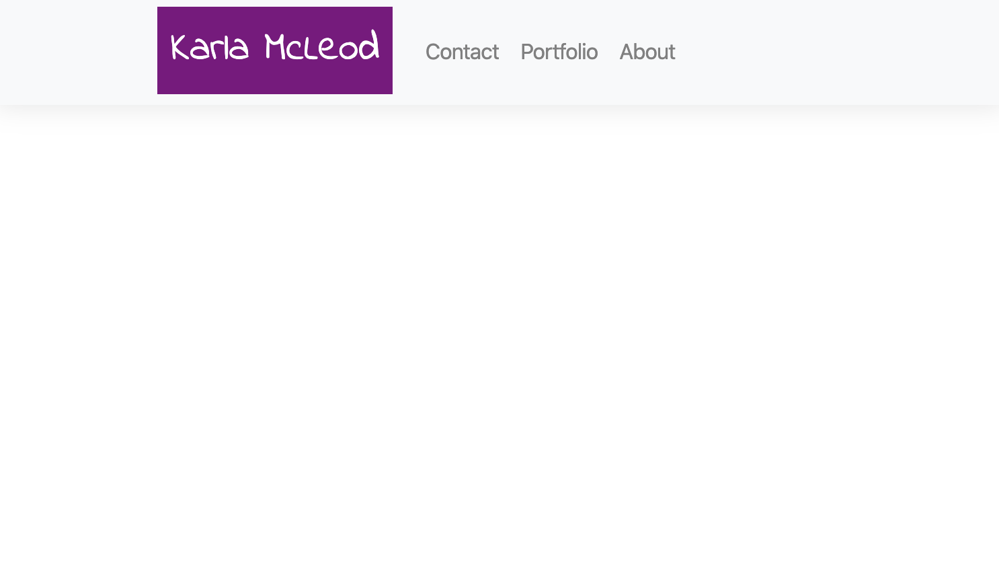

# bootstrap-portfolio

## Table of contents
* [General info](#general-info)
* [Technologies](#technologies)
* [Authors](#authors)
* [Aknowledgements](#aknowledgements)

## General info
A portfolio page created with HTML, Bootstrap, & CSS
    
## Technologies
Project is created with:
* HTML5
* CSS3
* Bootstap 4.4.1
    

## Authors

* **Karla McLeod** - *Initial work* - [Kmcleod81](https://github.com/Kmcleod81)

## Acknowledgments

* Billie Thompson for help with README file [PurpleBooth](https://github.com/PurpleBooth)
Photo by [thomas heintz](https://unsplash.com/@thomas2006?utm_source=unsplash&utm_medium=referral&utm_content=creditCopyText) on [Unsplash](https://unsplash.com/?utm_source=unsplash&utm_medium=referral&utm_content=creditCopyText)

## Link to Page

* https://kmcleod81.github.io/bootstrap-portfolio/
